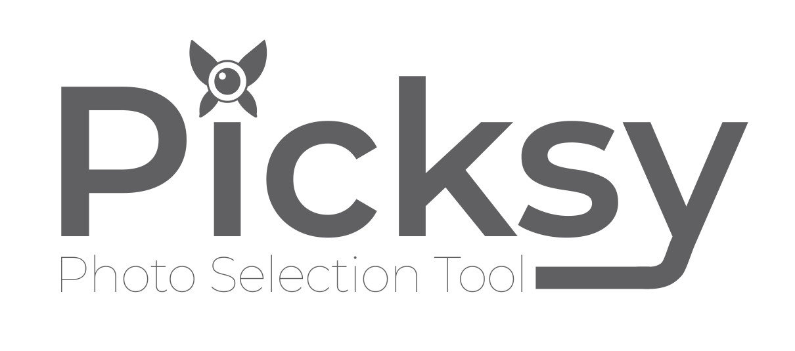

# Picksy



Picksy is a desktop application that helps you slim down your photo albums by grouping images into batches and letting you systematically select favorites. Non-selected images are moved to a "_delete" folder where you can delete permanently or archive.

If you are like me, when you take photos of things you take several all at once to try and get a good one. But over time, those extra photos sit in your camera roll taking up space and cluttering your gallery. When you go to show someone a photo from one of those batches, you just kinda guess from the thumbnail which is the "good one" or maybe flip through them.
I always had this problem and never found the time to sit down and sort through them. Eventually I had over 100GB of photos in my Google Photos account. I was too afraid to delete the batches because ONE of them IS the best one, and I just didn't know which one it was yet. So I made this tool to help me systematically review batches of photos and select ones for deletion.

Picksy is FREE, it is Open Source, and it runs entirely locally on your computer (your photos stay private!). It is also Non-Destructive; Picksy doesn't delete anything, it simply moves your non-selected photos to a subfolder called "_delete" where you can make the final call on whether you want to archive them or delete them forever.

You can 'Save and Quit' and Picksy will keep a savestate file in your folder that handles which pictures have been reviewed and which have not. You can come back and finish reviewing photos at a later date. You can even keep adding photos and Picksy will know which ones have been kept previously to save you time!

## Features
- **Photo Grouping**: Groups images with filenames like `YYYYMMDD_HHMMSS_XXX.jpg` (e.g., `20250122_171223_003.jpg`) taken within close proximity of each other.
- **Multiple Selection Modes**:
  - **Tournament Mode**: Compare two photos side-by-side and select favorites
  - **Thumbnail Mode**: View all photos in a grid and select/deselect individually
  - **Video Mode**: Review and manage video files
- **Tournament-Style Selection**:
  - Compare two photos side-by-side
  - Select a favorite by clicking or using Left/Right arrow keys
  - Keep both photos with the Up arrow
  - Move both to delete with the Down arrow
  - Keep all remaining photos with Enter
  - Move all remaining to delete with Space
  - Undo the last action with Z
- **Post-Selection Actions**:
  - View thumbnails of non-selected photos
  - Move non-selected to a "_delete" folder or cancel to keep all photos
  - Resume previous sessions with saved state

## Prerequisites
- [Node.js](https://nodejs.org/) (v18 or later recommended)
- [npm](https://www.npmjs.com/) (comes with Node.js)
- Windows, macOS, or Linux operating system

## Development Setup
1. Clone the repository:
   ```bash
   git clone https://github.com/<your-username>/Picksy.git
   cd Picksy
   ```

2. Install dependencies:
   ```bash
   npm install
   ```

3. Run in development mode:
   ```bash
   npm run dev
   ```

4. Build for production:
   ```bash
   npm run build
   ```

5. Create distributable packages:
   ```bash
   # Windows
   npm run dist:win
   
   # macOS
   npm run dist:mac
   
   # Linux
   npm run dist:linux
   
   # All platforms
   npm run dist:all
   ```

## Running Tests
```bash
npm test
```

## Technology Stack
- **Electron**: Desktop application framework
- **React**: UI library
- **TypeScript**: Type-safe JavaScript
- **Webpack**: Module bundler
- **Jest**: Testing framework

## License

Picksy is licensed under the [GNU AGPLv3](LICENSE) for open source use, ensuring that any derivative works, including SaaS applications, remain open source.


## Support Picksy
[Buy me a Coffee](https://buymeacoffee.com/neislerw) or Share with a friend!
